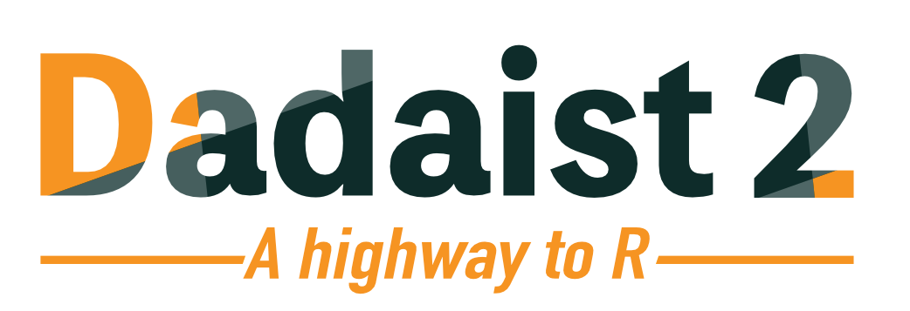

# dadaist2

Standalone wrapper for [DADA2](https://benjjneb.github.io/dada2/index.html) package, to quickly generate a feature table and a
set of representative sequences from a folder with Paired End Illumina reads.

# [Documentation and tutorials](https://quadram-institute-bioscience.github.io/dadaist2)

Please check the [online documentation](https://quadram-institute-bioscience.github.io/dadaist2) and tutorials
for installation and usage notes.

## Cite 

Ansorge, R., Birolo, G., James, S. A., & Telatin, A. (2021). Dadaist2: A Toolkit to Automate and Simplify Statistical Analysis and Plotting of Metabarcoding Experiments. _International journal of molecular sciences_, 22(10), 5309. [10.3390/ijms22105309](https://doi.org/10.3390/ijms22105309)
 
