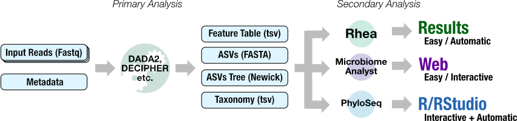
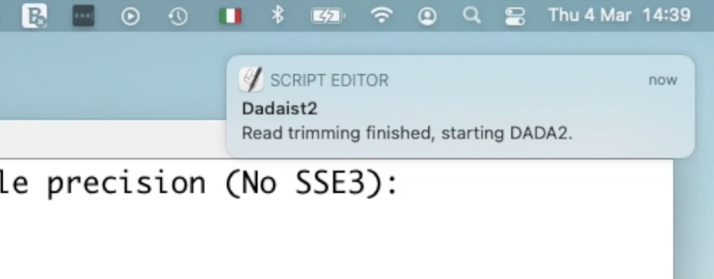

# Dadaist2 features

## Fast track to R and numerical ecology

Dadaist is a simple and modular toolkit to streamline the generation of
plots and analyses for microbiome studies, based on the popular DADA2
algorithm for reads denoising.

What makes Dadaist an interesting alternative to other suites is the focus on reproducible downstream analyses (thanks to the automatic generation of a PhyloSeq object and the preparation of files ready to be analysed with MicrobiomeAnalyst or Rhea)

* Generation of a [*PhyloSeq*](https://joey711.github.io/phyloseq/) object, for immediate usage in R
* Possibility to run in the pipeline a _custom R script_ that starts from the PhyloSeq object
* Generation of [*MicrobiomeAnalyst*](https://www.microbiomeanalyst.ca)-compatible files. MicrobiomeAnalyst provides a _web-interface_ to perform a broad range of visualizations and analyses.
* Generation of [*Rhea*](https://lagkouvardos.github.io/Rhea/)-compatible files. Rhea is a standardized set of scripts "_designed to help easy implementation by users_".
* Generation of [*MultiQC*](https://multiqc.info) ready report

## Mitigation of Cross-talk noise

Using [dadaist2-crosstalk]({{ '/pages/dadaist2-crosstalk.html' | relative_url }}) it is possible to reduce
the noise introduced by the spillover of reads from one sample to another sample in the same sequencing lane,
using the [_UNCROSS2_ algorithm](https://www.biorxiv.org/content/10.1101/400762v1.full).

## Long targets workflow

A custom DADA2 workflow that does not rely on read merging to identify molecular species
longer than the sequencing reads length. See some [ITS notes]({{ '/notes/2_ITS.html' | relative_url }}).

## Advanced logs and notifications

Dadaist2 is both a collection of tools (to create your own pipeline, for example using NextFlow) and a standalone 
pipeline designed to be easy to run from a local computer. 

* Colored terminal output to follow the progress of the pipeline
* Optional notification popups to follow the progress of the major steps while doing something else
* Regular text logs are also collected in an [easy to browse HTML report](example-log.html). 

