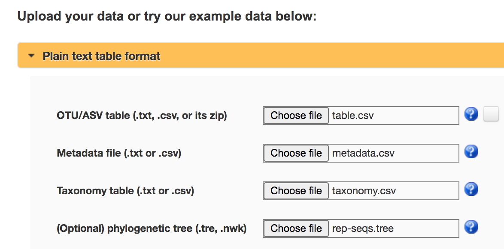
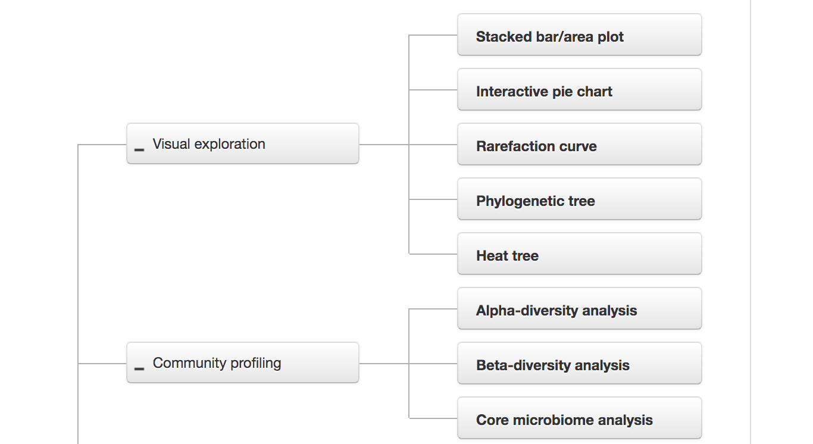
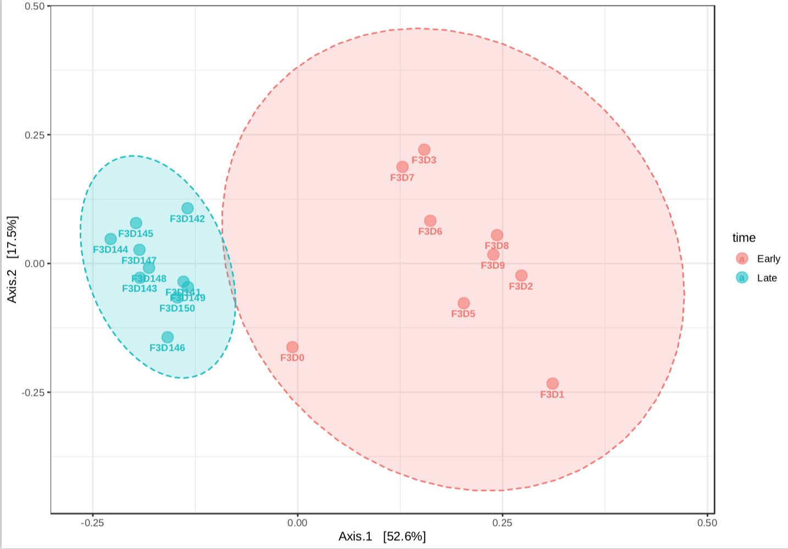

# Other tutorials

## "Mothur SOP" tutorial

The "[MiSeq SOP](https://mothur.org/wiki/miseq_sop/)" tutorial by Pat Schloss
is a well-known dataset coming from the paper:

> Kozich J. J. _et al.: (2013): **Development of a dual-index sequencing strategy and curation pipeline for analyzing amplicon sequence data on the MiSeq Illumina sequencing platform**. Applied and Environmental Microbiology [link](https://aem.asm.org/content/79/17/5112).

We will use this dataset to show how easy is to reproduce the main results with dadaist.

### Get the dataset

The dataset consits of 20 paired-end FASTQ files coming from the full dataset of the paper.

```bash
wget "https://mothur.s3.us-east-2.amazonaws.com/wiki/miseqsopdata.zip"
unzip miseqsopdata.zip
```

We can use SeqFu to check the number of reads:
```bash
seqfu stats -n MiSeq_SOP/*R1*.fastq
```

This will produce the following table:
```
┌─────────────────────────────────────────┬───────┬──────────┬───────┬─────┬─────┬─────┬─────┬─────┐
│ File                                    │ #Seq  │ Total bp │ Avg   │ N50 │ N75 │ N90 │ Min │ Max │
├─────────────────────────────────────────┼───────┼──────────┼───────┼─────┼─────┼─────┼─────┼─────┤
│ MiSeq_SOP/F3D0_S188_L001_R1_001.fastq   │ 7793  │ 1955914  │ 251.0 │ 251 │ 251 │ 251 │ 249 │ 251 │
│ MiSeq_SOP/F3D141_S207_L001_R1_001.fastq │ 5958  │ 1495347  │ 251.0 │ 251 │ 251 │ 251 │ 248 │ 251 │
│ MiSeq_SOP/F3D142_S208_L001_R1_001.fastq │ 3183  │ 798912   │ 251.0 │ 251 │ 251 │ 251 │ 250 │ 251 │
│ MiSeq_SOP/F3D143_S209_L001_R1_001.fastq │ 3178  │ 797624   │ 251.0 │ 251 │ 251 │ 251 │ 248 │ 251 │
│ MiSeq_SOP/F3D144_S210_L001_R1_001.fastq │ 4827  │ 1211542  │ 251.0 │ 251 │ 251 │ 251 │ 250 │ 251 │
│ MiSeq_SOP/F3D145_S211_L001_R1_001.fastq │ 7377  │ 1851563  │ 251.0 │ 251 │ 251 │ 251 │ 250 │ 251 │
│ MiSeq_SOP/F3D146_S212_L001_R1_001.fastq │ 5021  │ 1260202  │ 251.0 │ 251 │ 251 │ 251 │ 250 │ 251 │
│ MiSeq_SOP/F3D147_S213_L001_R1_001.fastq │ 17070 │ 4284410  │ 251.0 │ 251 │ 251 │ 251 │ 248 │ 251 │
│ MiSeq_SOP/F3D148_S214_L001_R1_001.fastq │ 12405 │ 3113525  │ 251.0 │ 251 │ 251 │ 251 │ 248 │ 251 │
│ MiSeq_SOP/F3D149_S215_L001_R1_001.fastq │ 13083 │ 3283570  │ 251.0 │ 251 │ 251 │ 251 │ 248 │ 251 │
│ MiSeq_SOP/F3D150_S216_L001_R1_001.fastq │ 5509  │ 1382628  │ 251.0 │ 251 │ 251 │ 251 │ 250 │ 251 │
│ MiSeq_SOP/F3D1_S189_L001_R1_001.fastq   │ 5869  │ 1473024  │ 251.0 │ 251 │ 251 │ 251 │ 250 │ 251 │
│ MiSeq_SOP/F3D2_S190_L001_R1_001.fastq   │ 19620 │ 4924442  │ 251.0 │ 251 │ 251 │ 251 │ 248 │ 251 │
│ MiSeq_SOP/F3D3_S191_L001_R1_001.fastq   │ 6758  │ 1696205  │ 251.0 │ 251 │ 251 │ 251 │ 250 │ 251 │
│ MiSeq_SOP/F3D5_S193_L001_R1_001.fastq   │ 4448  │ 1116401  │ 251.0 │ 251 │ 251 │ 251 │ 250 │ 251 │
│ MiSeq_SOP/F3D6_S194_L001_R1_001.fastq   │ 7989  │ 2005171  │ 251.0 │ 251 │ 251 │ 251 │ 250 │ 251 │
│ MiSeq_SOP/F3D7_S195_L001_R1_001.fastq   │ 5129  │ 1287342  │ 251.0 │ 251 │ 251 │ 251 │ 248 │ 251 │
│ MiSeq_SOP/F3D8_S196_L001_R1_001.fastq   │ 5294  │ 1328727  │ 251.0 │ 251 │ 251 │ 251 │ 250 │ 251 │
│ MiSeq_SOP/F3D9_S197_L001_R1_001.fastq   │ 7070  │ 1774487  │ 251.0 │ 251 │ 251 │ 251 │ 250 │ 251 │
│ MiSeq_SOP/Mock_S280_L001_R1_001.fastq   │ 4779  │ 1199027  │ 250.9 │ 251 │ 251 │ 250 │ 249 │ 251 │
└─────────────────────────────────────────┴───────┴──────────┴───────┴─────┴─────┴─────┴─────┴─────┘
```

### Get the reference database
If you already downloaded a suitable reference database, you can skip this step.
We will use SILVA 138 (that is available both for DECIPHER and DADA2 naive classifier).
In this example we'll use the "DADA2" version:

First, we can check which SILVA database are available for download:
```bash
dadaist2-getdb --list silva
```

Then we can download one from the list (or all of them). The following command will
download the 'dada2-silva-138' database in our home directory, under the `refs` subdirectory.

```bash
dadaist2-getdb -d dada2-silva-138 -o ~/refs/
```


### Refactoring the metadata file

The dataset comes with a tabular file with metadata called `MiSeq_SOP/mouse.time.design`.
We can rename the header and this will suffice to work with Dadaist2 (that expected
  a `#SampleID` column):

```bash
sed 's/group/#SampleID/g' MiSeq_SOP/mouse.time.design > metadata.tsv
```

Note that the metadata is missing an entry for the mock community: either add it to the
metadata or remove it from the dataset.

```bash
echo -e "Mock\tControl" >> metadata.tsv
```

### Running Dadaist2

The minimum parameter to run Dadaist are:
* `-i`: directory with the input reads, with `_R1` and `_R2` tags
* `-o`: output directory
Recommended parameters are:
* `-d`: to specify a reference database (will enable taxonomy annotation)
* `-m`: metadata file (if not provided a blank metadata file is generated)
* `-t`: number of threads
  
```bash
dadaist2  -i MiSeq_SOP/ -o dadaist2-sop -m metadata.tsv -d ~/refs/silva_nr_v138_train_set.fa.gz
```

### Exploring the dataset with Microbiome Analyst

The output folder contains a subdirectory called _MicrobiomeAnalyst_.
We can go to [MicrobiomeAnalyst](https://www.microbiomeanalyst.ca/MicrobiomeAnalyst/upload/OtuUploadView.xhtml)
and upload our table, taxonomy and metadata:



After deciding if and how to normalize or rescale our data (we used the defaults settings here),
you'll land on the tool box page:



We can perform a PCA analysis and check if there is a separation between the "Early" and "Late"
samples, as shown in the original paper:




# Documentation

```note
This section is under costruction
```

In this website:
 * [manual pages]({{ 'pages' | relative_url }})
