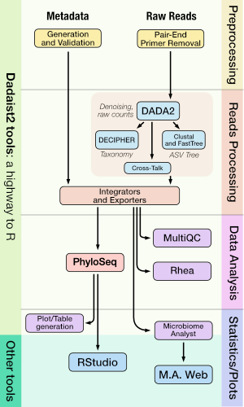

 

# Dadaist2: highway to R

Standalone wrapper for [DADA2](https://benjjneb.github.io/dada2/index.html) package, to quickly generate a feature table and a
set of representative sequences from a folder with Paired End Illumina reads.
*Dadaist2* is designed to simplify the stream of data from the read processing to the statistical analysis and plots.

Dadaist2 is an highway to downstream analyses:
* Generation of a [*PhyloSeq*](https://joey711.github.io/phyloseq/) object, for immediate usage in R
* Possibility to run in the pipeline a _custom R script_ that starts from the PhyloSeq object
* Generation of [*MicrobiomeAnalyst*](https://www.microbiomeanalyst.ca)-compatible files. MicrobiomeAnalyst provides a web-interface to performe a broad range of visualizations and analyses.
* Generation of [*Rhea*](https://lagkouvardos.github.io/Rhea/)-compatible files. Rhea is a standardized set of scripts "_designed to help easy implementation by users_".

In addition to this:
* Has a custom primer removal tool that discards noisy reads (missing primers or having too much of them).
* Has a custom mode for _variable length_ amplicons (i.e. ITS), to detect features longer than the sum of the paired-end reads.
* Ships an open source implementation of *[UNCROSS2](https://www.biorxiv.org/content/10.1101/400762v1.full)* by Robert Edgar.
* Has a modular design that allows recycling parts of it in custom workflows.

You can [read more](introduction) about the features.

:package: See the **[repository](https://github.com/quadram-institute-bioscience/dadaist2)**

## The workflow

## Contents


