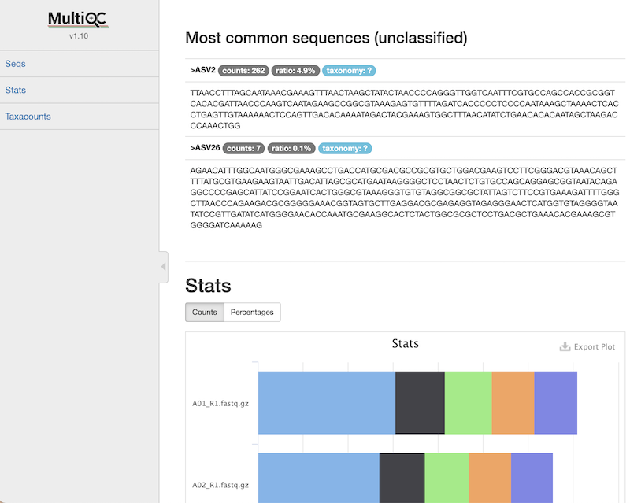

# MultiQC report

Dadaist2 generates a MultiQC ready directory to generate a QC report using [MultiQC](https://multiqc.info),
saving the files in the `./multiqc` directory inside the output directory.

The report can be generated if MultiQC is installed, otherwise:
```
cd $OUTPUT/multiqc
multiqc -f .
```

## Notable sections

* The most abundant **representative sequences** (separated in unclassified and classified) are reported to be manually inspected, to allow to check for contaminants (among the unclassified) and to control the taxonomy classification
* **Taxonomy plots** are reported for a preliminary overview
* A correlation **matrix** allows to check if replicates are indeed closely correlated
* **Octave plots**, based on the distribution of counts per sample, allow to evaluate the level of _noisy sequences_
* Beta diversity **matrix**


## Screenshot

An [example](https://quadram-institute-bioscience.github.io/dadaist2/mqc/) is available on this website.



