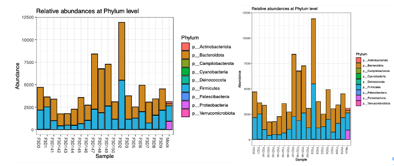

# Integration with R

Dadaist2 relies on automation of R processes at the core, so as a design choice the wrapper and launchers all collect data to be fed to R Scripts. 
In this way it’s impossible to distinguish the output produced natively by R or from Dadaist scripts. 
For example the `dadaist2-assigntax` program contains the logic and the input collection/validation, while it’s companion script `D2-dada-taxonomy.R` is executed to perform the Dada2/Decipher taxonomy annotation. 
Moreover, by design, we promote the installation via Miniconda to ensure the creation of an environment 
with a dedicated R ecosystem with version control of R and its dependencies. 
The importance of this decision is also to make the current and future updates on the pipeline -- 
that we are committed to produce as part of our ongoing longitudinal studies -- 
will remain independent of the actual implementation as long as the R part is on a separate R script.
The comparison we made on the primary analysis is very important, 
as the primary analysis is a mix of R (DADA2) and external tools 
(quality check, adaptor removal etc) and the code is more complex and benefits 
from a functional comparison. We initially omitted the comparison of secondary 
analyses as they only require R commands (and thus have a complete overlap 
between Dadaist and the same commands run in R) and for the wider variability 
in secondary analysis that the user is enabled by Dadaist.

## Comparison of an R-based workflow

We performed a manual analysis in R requiring the generation of a PhyloSeq object, followed
by the generation of a taxonomy plot (using PhyloSeq) and a bubble plot with custom
R commands.

The manual R workflow [is available here](plot.html), while the Dadaist2 script used is `dadaist2-taxplot`.

## Results

The two workflow produce identical PhyloSeq objects and identical plots.

Taxonomy barplots (manually generated from R, _left_, and automatically generated, _right_)

Taxonomy bubble plots (manually generated from R, _left_, and automatically generated, _right_)

